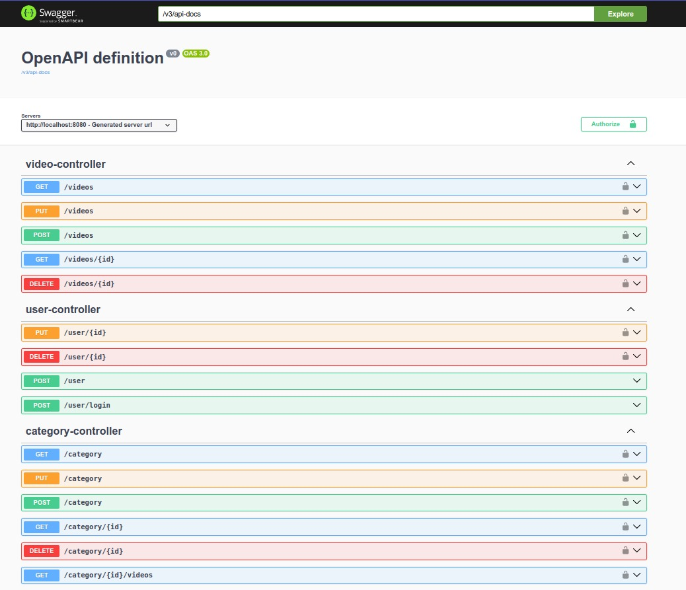

<h1 align="center">API para Aplicação Web de Streaming com Spring</h1>

&nbsp;

Este projeto foi desenvolvido com base no desafio 5 proposto pela escola de programação Alura. Ele tem como objetivo praticar e consolidar os conhecimentos adquiridos sobre o Spring Framework e outras tecnologias.

 

  
   

## ✔️ Técnicas e tecnologias utilizadas

Algumas das técnicas e tecnologias utilizadas no projeto foram:

- **`Spring Framework`**: Framework open source para a plataforma Java criado por Rod Johnson.
- **`JWT`**:  Técnica RFC-7519 com a função de autenticação entre duas partes, por meio de um token assinado.
- **`JUnit`**: Framework open-source, que se assemelha ao raio de testes software java, criado por Erich Gamma e Kent Beck.
- **`SpringDocs`**: Implementaçãos da especificação OpenAPI.
- **`Pitest`**: Sistema de teste de mutação para Java e JVM.
- **`Lombok`**: Biblioteca Java focada em produtividade e redução de código boilerplate.

